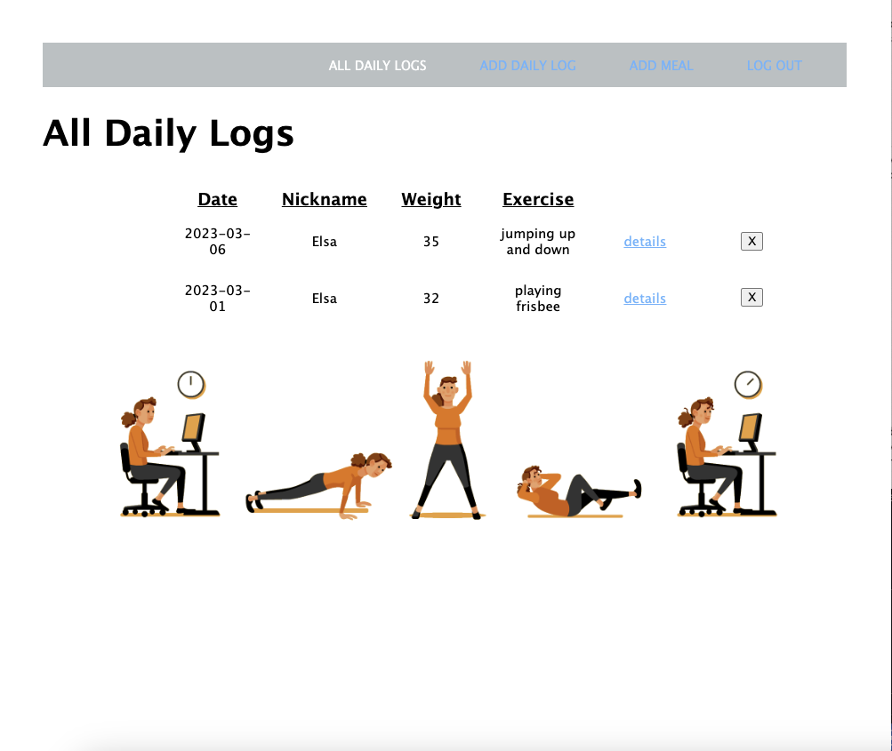

# mybalancejourney
Title: mybalancejourney

# About Project 
I wanted to develop a fitness tracker so user can keep track of the exercise and meals. The tracker will assist user to realize what they did for the entire day and they can keep updating throughout the day. I want to make sure people are on track of their exercise and meals so they don’t overeat or miss a workout. As a result, this project has helped me track my time and meals so I can lose some weight and develop my technical skills.
* Applicant can use OAuth to log into account.
* Application has full CRUD functionality to create, edit, and delete logs and meals.
* Web Application is fully functional and easy to use. 

# Screenshots

# Languages and Tools Used: 
* HTML5
* CSS3
* JAVASCRIPT
* NODE.JS
* EXPRESS.JS
* MONGODB

# To Get Started
To access my project: [mybalancedjourney](https://jennyyhfang.github.io/mybalancedjourney/)

# Future Features
* Add in exercise plans, videos, and instructions how to use equipments
*Allow other users to share their tips and secrets
* Add calculators and instructions to lose, maintain, or gain weight 